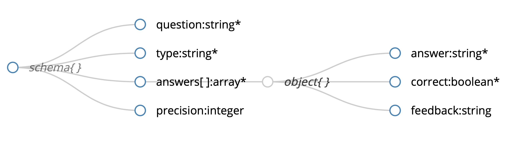

# jupyterquiz
JupyterQuiz is a tool for displaying interactive Quizes in Jupyter notebooks and Jupyter Book.

It currently supports two types of quiz questions:
1. **Multiple/ Many Choice Questions:** Users are given a predefined set of choices and click on answer(s) they believe are correct.
2. **Numerical:** Users are given a text box in which they can submit answers in decimal or fraction form.

Each type of question offers different ways to provide feedback to help users understand what they did wrong (or right). Questions can be written as JSON or loaded from a dictionary in Python. 

## Multiple/Many Choice Questions

Multiple/Many Choice questions are defined by a Question, an optional Precision an optional Code block, and a list of possible Answers, which include details on whether the Answer is correct and Feedback to be displayed for that Answer. The schema for Multiple/Many Choice Questions is shown below:
  

